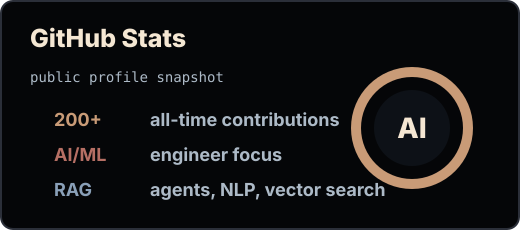
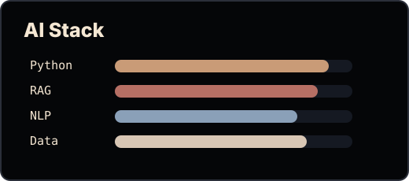
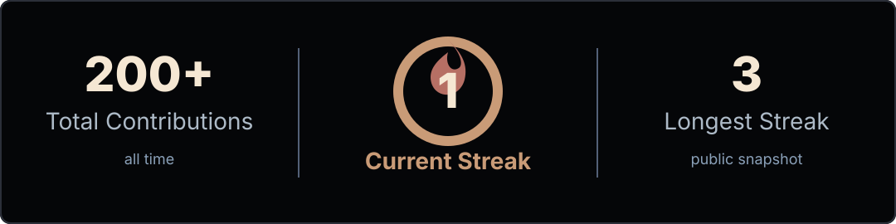
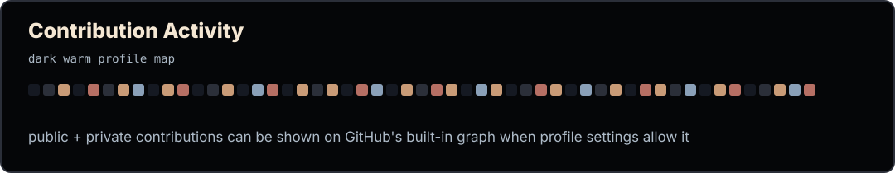

<div align="center">


### hi, i'm akira

`AI developer building RAG pipelines, ML systems, and agent workflows`

<a href="https://github.com/akiraxld"></a>
<a href="https://github.com/akiraxld?tab=followers"></a>
<a href="https://www.linkedin.com/in/arailym-azatkyzy-5866643ab"></a>

</div>

---

## About

I am an AI/ML Engineer and Data Science student focused on practical AI systems.

- Building RAG pipelines, vector stores, document ingestion, chunking, embeddings, and source-cited retrieval
- Working on AI agents for recruitment, legal document analysis, and tutor platforms
- Interested in NLP, machine learning systems, data analytics, and applied automation
- Currently an AI/ML Engineer at **Sergek Security**

## AI Focus

```txt
RAG systems    PDF/DOCX/PPTX ingestion, chunking, embeddings, vector search
AI agents      tool-calling, intent routing, workflow logic
NLP            resume parsing, summarization, classification, clustering
ML systems     scoring, deduplication, model training, analytics
```

## Stack

<p>
  
  
  
  
  
  
  
  
  
  
</p>

## GitHub Stats

<div align="center">




<br />
<br />



<br />
<br />



</div>

## Projects

| Project | What it does | Stack |
| --- | --- | --- |
| **Reddit Thread Intelligence** | Reddit discussion analysis with sentiment, topic clustering, and a custom polarization metric | Python, Pandas, scikit-learn, Streamlit, Plotly, NLTK |
| **Znak** | Real-time ASL recognition and learning platform with live browser feedback | Python, MediaPipe, scikit-learn, Streamlit, WebRTC |
| **IT Labor Market Analytics** | Dashboard for Kazakhstan's IT and digital labor market survey data | Power BI, data modeling, data visualization |
| **Film Industry DBMS** | Normalized Oracle database with PL/SQL packages, triggers, and bulk operations | PL/SQL, Oracle APEX, Mockaroo |

---

<div align="center">

<sub>dark profile, warm details, useful AI systems.</sub>

</div>
